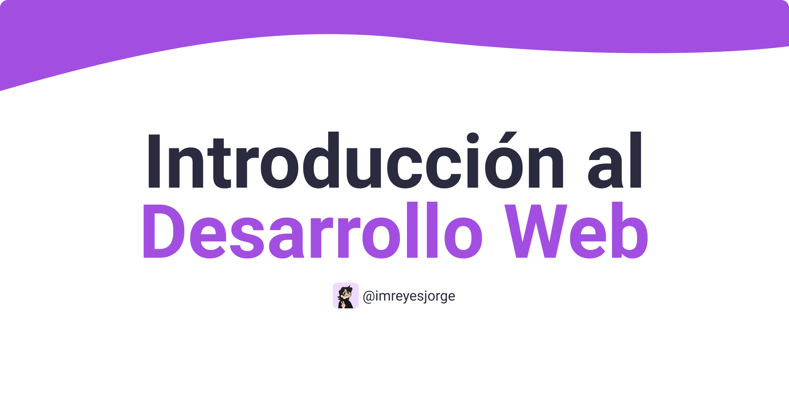

## ¿Qué es HTML y CSS?

-   **HTML** (Hypertext Markup Language) es un lenguaje de etiquetas, utilizado para definir la estructura de una página web.

-   **CSS** (Cascading Style Sheets) es un lenguaje para definir el estilo de la página web. Refiriéndonos a cómo se va a ver la página (_tamaños, colores, posición, etc..._).

###### Si quieres saber más, puedes visitar la [World Wide Web Consortium (W3C)](https://www.w3.org/standards/webdesign/htmlcss).

## Objetivo del Taller

El objetivo del taller será el lograr entender que es _html_ y _css_, así como conocer algunos conceptos fundamentales y motivar a investigar para aprender mucho más sobre estas dos tecnologías.

## Temas

### ¿Qué es HTML?

-   [¿Qué es _HTML_?](material/Page1.md)
-   [Etiquetas](material/Page2.md)
-   [Clases e ID's](material/Page4.md)
-   [Etiquetas: `<style>` y `<link>`](material/Page4.md)

### ¿Qué es CSS?

-   [¿Qué es _CSS_?](material/Page5.md)
-   [Selectores](material/Page6.md)
-   [Propiedades](material/Page7.md)

### Ejercicio

-   [Ejercicio: Mi primera página web](material/ejercicio.md)

## Más allá de este taller y notas:

> **ASCII**: abreviatura para American Standard Code for Information Interchange.

> **HIPERVÍNCULO**: Se llama _hipervínculo_ o _hiperenlace_ a un tipo de elemento presente en los documentos electrónicos que hace alusión a otro documento diferente, a una parte específica del mismo documento o a otro recurso de cualquier naturaleza, como búsquedas online, mecanismos de compra, suscripciones, etc.

[Ejemplos de CSS | CssZenGarden](http://www.csszengarden.com/)

## [Siguiente](material/Page1.md)

Hecho con ❤️ por [Jorge Reyes](https://github.com/imreyesjorge)

